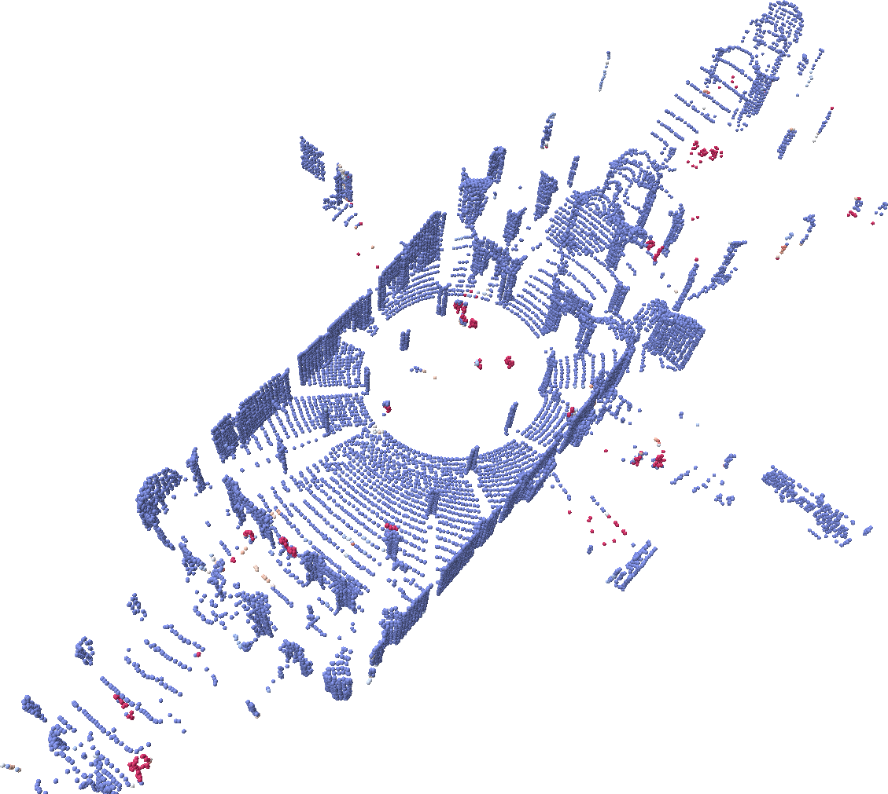
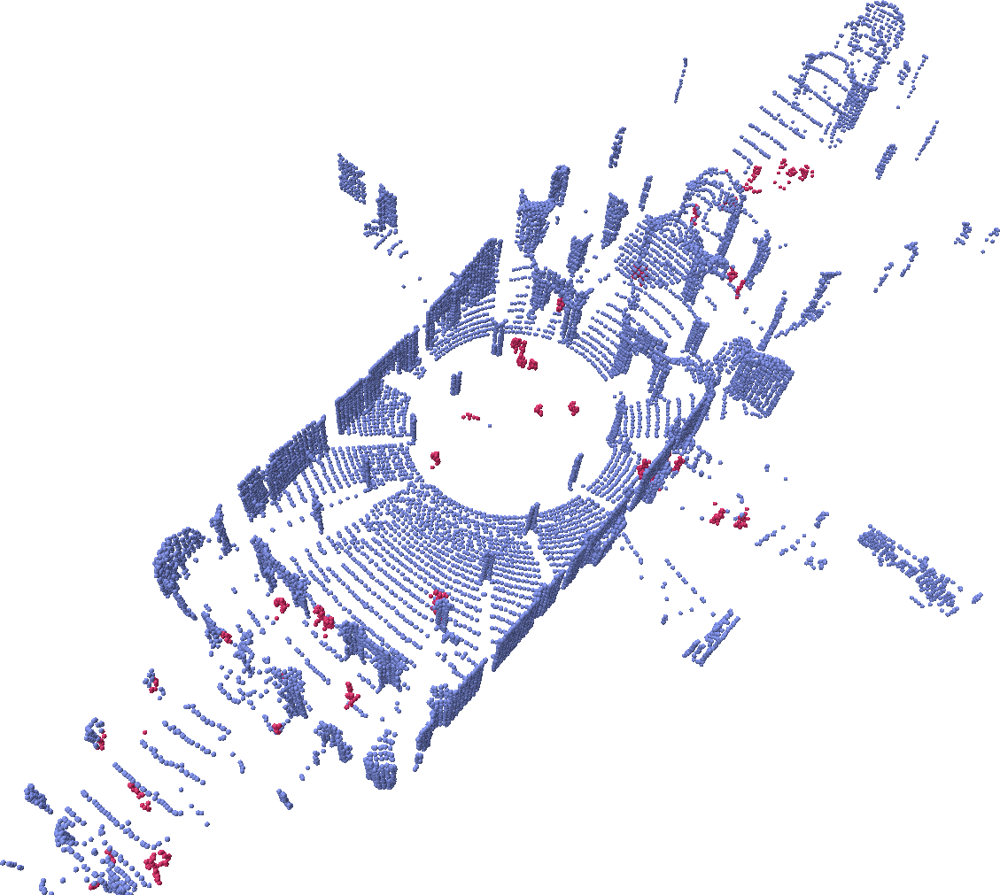

# dynamic_object_detection
Ros implementation of "Dynamic Object Detection in Range data using Spatiotemporal Normals" (published at the Australasian Conference on Robotics and Automation (ACRA) and available [here](https://ssl.linklings.net/conferences/acra/acra2023_proceedings/views/includes/files/pap125s2.pdf)).

Predictions (left) versus ground truth (right):



### Paper:
If you find this work useful for your research, please consider citing our paper (submitted to ACRA 2023):
  ```bibtex
  @inproceedings{falque2023dynamic,
      title={Dynamic Object Detection in Range data using Spatiotemporal Normals}, 
      author={Raphael Falque and Cedric Le Gentil and Fouad Sukkar},
      booktitle={Australasian Conference on Robotics and Automation, ACRA},
      year={2023}
  }
  ```


### Datasets:

> [!NOTE]  
> Some of the preprocessed ros bags are available [here](https://drive.google.com/drive/folders/1QsDQK4fyBwQuhsV-uN1_ljqh-wp1RCJF?usp=share_link) (`hauptgebaeude` folder for the DOALS dataset and `HRI` folder for the data from the UR5).

The method has been tested on a dataset collected with a UR5 robot arm.

We have also tested our approach on the [undistorded scans](https://github.com/ethz-asl/lidar_undistortion/) from the Urban Dynamic Objects LiDAR Dataset (DOALS) ([project page](https://projects.asl.ethz.ch/datasets/doku.php?id=doals), [direct link to downloads](http://robotics.ethz.ch/~asl-datasets/2021_ICRA_dynamic_object_lidar_dataset/scenes/)). See images above for samples from the dataset.


### Requirements

Install ROS following [these instructions](http://wiki.ros.org/noetic/Installation/Ubuntu) (ROS2 is not implemented).

```bash
sudo apt install build-essential cmake libeigen3-dev libomp-dev git
```

### To build:

```bash
git clone git@github.com:UTS-RI/dynamic_object_detection.git
ln -s ./dynamic_object_detection ~/catkin_ws/src
cd ~/catkin_ws
catkin_make
```

### To run:

For the DOALS dataset:
```bash
roscore
rosbag play sequence_1.bag # undistorded LIDAR scans
roslaunch dynamic_detector normal_filter.launch
```

For the UR5 dataset:
```bash
roscore
rosbag play object_move_with_poses.bag
roslaunch dynamic_detector normal_filter_arm.launch
```
